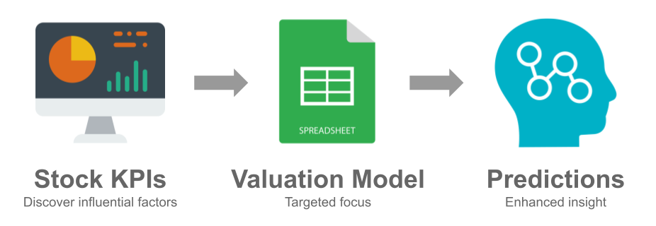
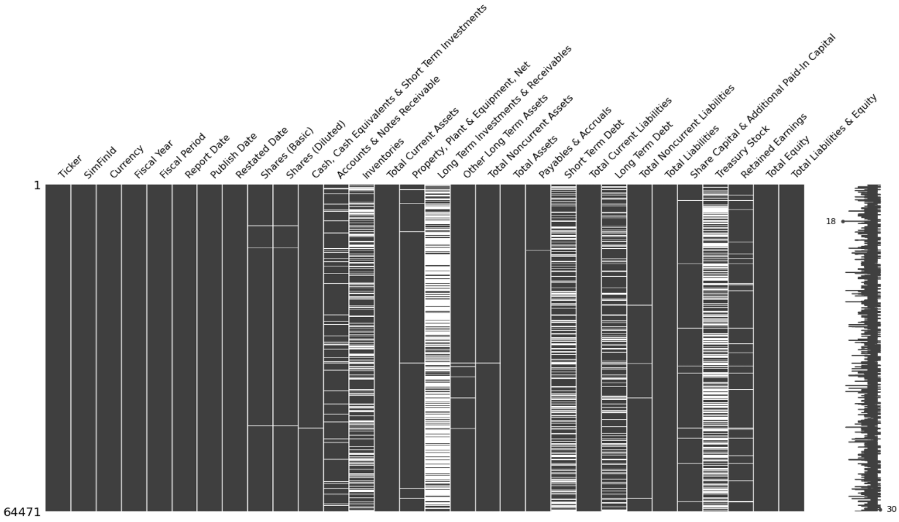
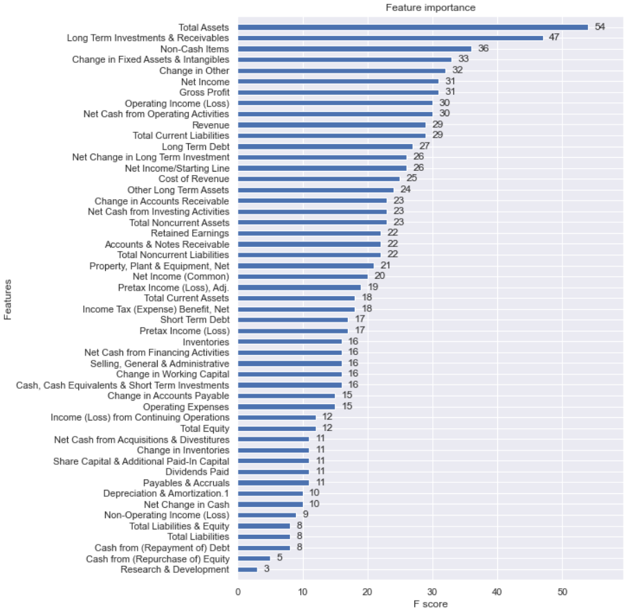
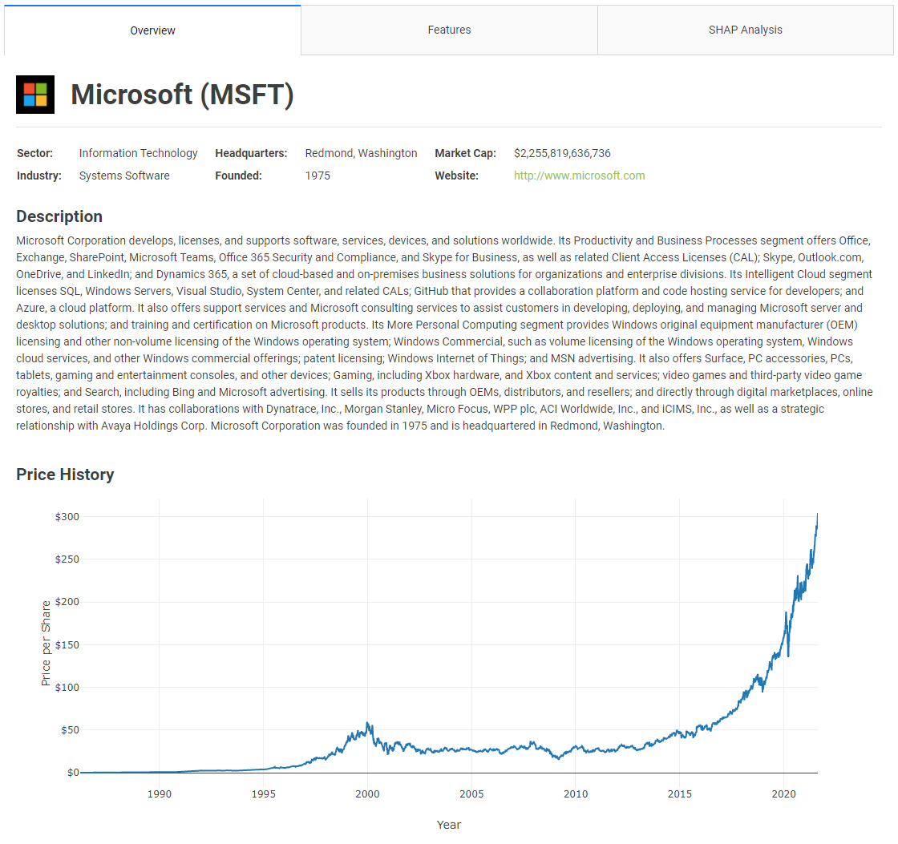
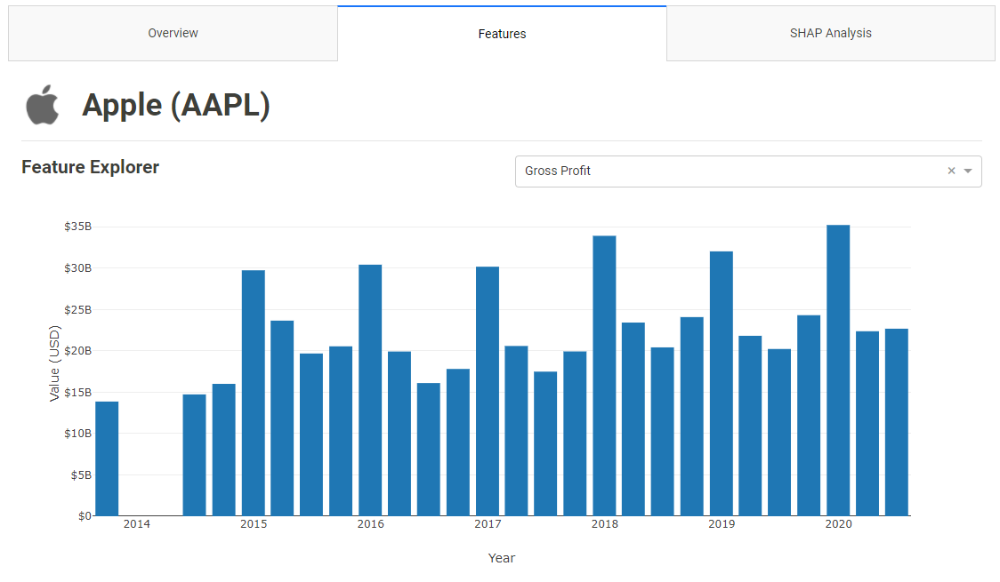
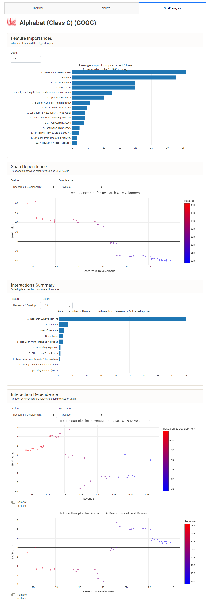

# Stock KPIs
## Project Overview
### Business Problem
As [defined by Investopedia](https://www.investopedia.com/terms/k/kpi.asp), a Key Performance Indicator (KPI) is "... a set of quantifiable measurements used to gauge a company's overall long-term performance." While KPIs are typically used internally to measure goal-specific progress, this project aims to extend the idea and provide a proof-of-concept analysis of the most important fundamental factors with regard to a given company's share price.

Traditional equity valuation models rely on some form of forecasting the evolution of income sheet, balance sheet, and cash flow statement line items into the near future combined with an expected terminal value. While this methodology is the theoretically "correct" way to value a company's equity, there is no inherent check for the relative importance of each line item beyond the valuation analyst's domain expertise. Enhanced insight into these relative importances would allow for more efficient utilization of the analyst's focus and could ultimately lead to more accurate valuations and price predictions. A simplified workflow incorporating the Stock KPIs project would look as follows:



### Data Sources
Multiple data sources were used in order to complete this project. Initially, all fundamental data was downloaded in bulk directly from the SEC using their relatively new [EDGAR API](https://www.sec.gov/edgar/sec-api-documentation). However, due to lack of documentation, support, and missing values, this data was scrapped in favor of alternative sources of fundamental data such as [SimFin](https://simfin.com/). Historical pricing data and miscellaneous company information (website, business summary, etc.) was obtained from Yahoo! Finance via the [`yfinance`](https://github.com/ranaroussi/yfinance) package. Finally, the list of current S&P 500 constituents (as of late August 2021) was retrieved from the *[List of S&P 500 companies](https://en.wikipedia.org/wiki/List_of_S%26P_500_companies)* article on Wikipedia.


### Repository Structure
```
├── archive/                 # Archived SEC data and notebooks
├── data/                    # See more detailed explanation below
│    ├── merged_data/
│    ├── preprocessed_data/
│    ├── price_histories/
│    ├── simfin/
│    └── sp500.csv
├── images/                  # Images used in the readme, presentation, etc.
├── models/                  # Exported models using joblib
├── notebooks/               # Notebooks used for data gathering, prep, modeling, etc.
├── submissions/             # Files used for the project submissions
├── .gitignore
├── LICENSE
└── README.md
```

Further explanation of the `data` directory is warranted given the multiple subdirectories. 
- `merged_data` contains files for companies where the price histories and fundamental data has been merged together.
- `preprocessed_data` contians files for each file in the `merged_data` directory that has had its missing values handled.
- `price_histories` contains historical share price data for each company.
- `simfin` contains fundamanetal data for each company's income sheet, balance sheet, and cash flow statement.
- `sp500.csv` is a file that contains a list of each company in the S&P 500 with basic information such as the ticker, company name, industry, etc.

## Preprocessing
### Merging Data
After obtaining both the fundamental data and share price history of a given company, the data needed to be merged into a single file for modeling purposes. To accomplish this, the income sheet, balance sheet, and cash flow statement data contained in the `data/simfin` directory was filtered to the targeted company and then concatenated.

```python
# Concatenating financials
financials = pd.concat([income, balance, cashflow], axis=1).reset_index()
```

Since the fundamental data is released on a quarterly basis, merging in the price history required an asof merge via [`pandas.merge_asof`](https://pandas.pydata.org/pandas-docs/version/0.25.0/reference/api/pandas.merge_asof.html) which allowed for finding the closest price value for each report date of the fundamentals.

```python
# Merging in prices
final_df = pd.merge_asof(left=financials,
                         right=prices,
                         left_on='Report Date', 
                         right_on='Price Date', 
                         direction='backward')
```

### Handling Missing Values
Certain fundamental data retrieved from SimFin was sparsely populated. As an example, the below image shows the `missingno.matrix()` function called on the balance sheet data for all companies.



Imputation is a somewhat risky methodology for this particular data, even with more advanced techniques such as iterative imputation. While not ideal, the safest route was to drop those columns which did not meet a certain minimum non-null threshold and then drop the remaining rows with null values thereafter. This threshold was set at 30 in order to ensure enough data was available for the model to work with. For context, when the fundamental data was filtered down to a specific company, there would typically be around 60-65 rows of data total. 

```python
for i, ticker in enumerate(snp_tickers):
    # Loading in data
    df = pd.read_csv(f'../data/merged_data/{ticker}_merged.csv')
    
    # Dropping columns below the threshold
    threshold = 30
    to_drop = [col for col in df.columns if df[col].isna().sum() > len(df) - threshold]
    df = df.drop(columns=to_drop)
    
    # Dropping rows with remaining missing data
    df = df.dropna()
    
    # Exporting dataframe
    df.to_csv(f'../data/preprocessed_data/{ticker}_preprocessed.csv', index=False)
```

It is important to note that this process was done in a company-specific manner in order to preserve as much information as possible. As a result, certain features may have been dropped for Company A that were kept for Company B due to differences in the number of missing values for those particular companies.

## Modeling
### `XGBRFRegressor`
The XGBoost Random Forest Regressor was chosen as the model to use based on the following key attributes:
- Resiliency to overfitting, outliers, and non-linear data
- Lack of normalization requirements due to its rule-based approach
- Parellelization allows for faster computation time
- Handles high dimensionality of data with ease

### Hyperparameter Tuning
The following hyperparameters were optimized using the `GridSearchCV` function from the `sklearn.model_selection` module.

```python
xgb_rf_params = {'max_depth': [4, 5, 6, 7, 8],
                 'colsample_bylevel': [0.2, 0.5, 0.8],
                 'colsample_bytree': [0.2, 0.5, 0.8],
                 'gamma': [1, 25, 50],
                 'learning_rate': [0.01, 0.05, 0.25, 0.50],
                 'random_state': [42]}
```

### Example Feature Importances
An example of the feature importances values obtained from fitting a hyperparameter optimized `XGBRFRegressor` model to the data for Microsoft (MSFT) can be seen below.



### Exporting Models
After running a test case on one ticker, a `for` loop was constructed to iterate over each ticker in the list of S&P 500 tickers and accomplish the following:
- Read in the preprocessed .csv file to a dataframe from the `data/preprocessed` directory for the given ticker
- Check for and handle rare errors such as `EmptyDataError` or `KeyError`
- Fit a hyperparameter optimized `XGBRFRegressor` model to the data
- Export the best performing estimator to the `models` directory with the following code:

```python
# Exporting model
best = model.best_estimator_
joblib.dump(best, f'../models/{ticker}_model.joblib')
```

## Interactive Dashboard
### Running the Dashboard
To run the dashboard, simply set the `ticker` variable in `app.ipynb` (under the `notebooks` directory) to a company in the S&P 500 and then run the notebook.

```python
ticker = 'AAPL'
```

The majority of the code in the `app.ipynb` notebook is responsible for loading in the proper saved model, fetching company information, and defining the layout of the dashboard. The following code at the end of the notebook is responsible for actually running the dashboard:

```python
db = ExplainerDashboard(explainer,
                        tabs=[OverviewTab, FeaturesTab, SHAPTab],
                        title='Stock KPIs',
                        description='',
                        bootstrap=dbc.themes.SANDSTONE,
                        fluid=False,
                        header_hide_download=True,
                        hide_poweredby=True)

db.run(port=8050)
```

### Overview Tab
The Overview tab provides basic information on the selected company along with a business summary and historical price chart.



### Features Tab
The features tab allows for exploring the selected company's various fundamental data. 



### SHAP Analysis Tab
The SHAP Analysis tab contains fulfills the project's goal by detailing the relative importances of the various fundamental factors for the given company. 

The following description of SHAP from its [repository](https://github.com/slundberg/shap) provides a brief explanation of the values:
>SHAP (SHapley Additive exPlanations) is a game theoretic approach to explain the output of any machine learning model. It connects optimal credit allocation with local explanations using the classic Shapley values from game theory and their related extensions (see [papers](https://github.com/slundberg/shap#citations) for details and citations).

In essence, the SHAP values show how an individual feature impacted the results of the model.



## Future Improvements
- Investigate enhanced preprocessing and modeling techniques for better results
- Rank companies by specific fundamentals (e.g., which companies have the highest SHAP values for R&D?)
- Include additional model analysis components either from the `explainerdashboard` library or custom-built
- Allow for changing between companies directly within the dashboard (requires core code changes to the underlying `explainerdashboard` library)